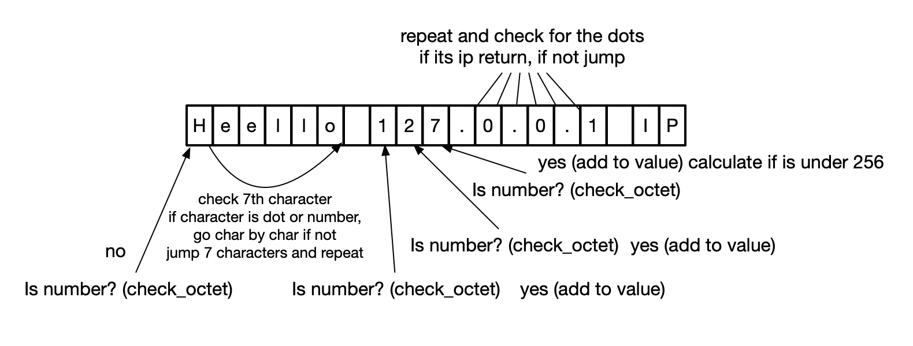

# Deterministic Fast Parsing (DFP)

## Basic information and technical example

Deterministic fast parsing is derivated from deterministic finite automaton 

DFP work very simply, is singlecore process where input is string of big length (or stream of data), parser will go char by char and determine if state is correct or should be skipped to next potentional substring.

If all chars satisfy all states, subchar is returned (in few cases like ipv4 can be returned int representation of ip address).

For example DFP/ipv4:

```Heello 127.0.0.1 IP```



## Installation

```bash
$ git clone https://github.com/lukasbalazik123/DFP.git
$ cd DFP
$ make
```

### Tests

Testing machine stats:

```bash
Processor Name: Quad-Core Intel Core i7
Processor Speed: 2,8 GHz
Number of Processors: 1
```
Now run benchmark:

```bash
$ ./build/benchmark_with_vectors
IPv4 DFP benchmark with vectors parsing takes: 0.017169
Domain DFP benchmark with vectors parsing takes: 0.019172
```

when we get size of logfile we can calculate per second speed of parsing:

```bash
$ ls -la log_examples/*
-rw-r--r--  1 regusr  staff   4541157 Jul 21 12:54 log_examples/apache_access.log
-rw-r--r--  1 regusr  staff  26214400 Jul 21 09:19 log_examples/suricata.log
$ echo "1/0.017169*26214400" | bc
1520435200
$ echo "1/0.019172*4541157" | bc
236140164
```

For IPv4 addresses 1520435200 bytes is around **11.3** Gb per second on singlecore parser

For domains 236140164 bytes is around **1.7** Gb per second on singlecore parser

## Usage

TODO

